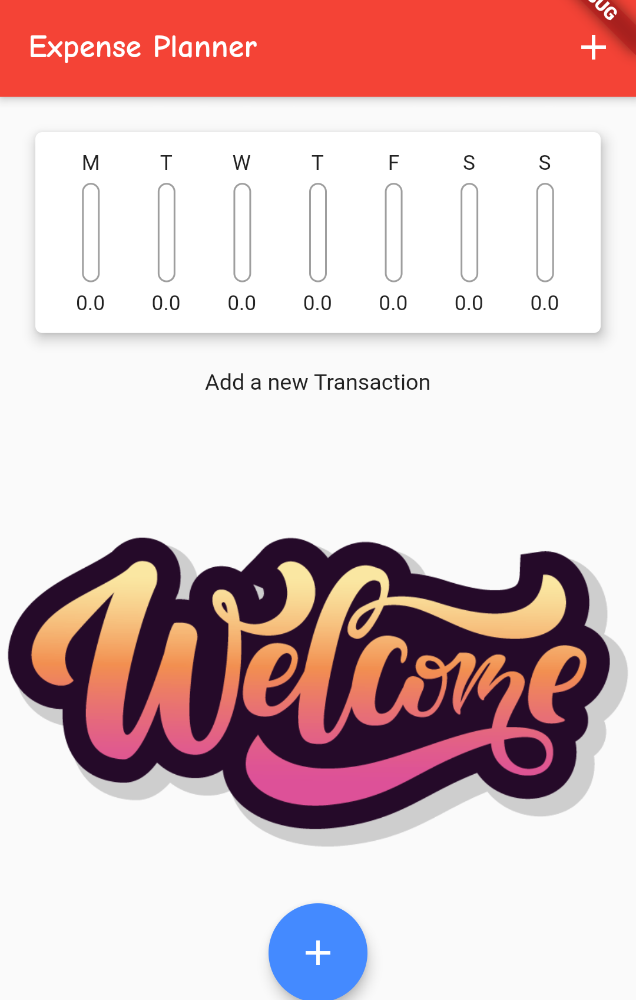
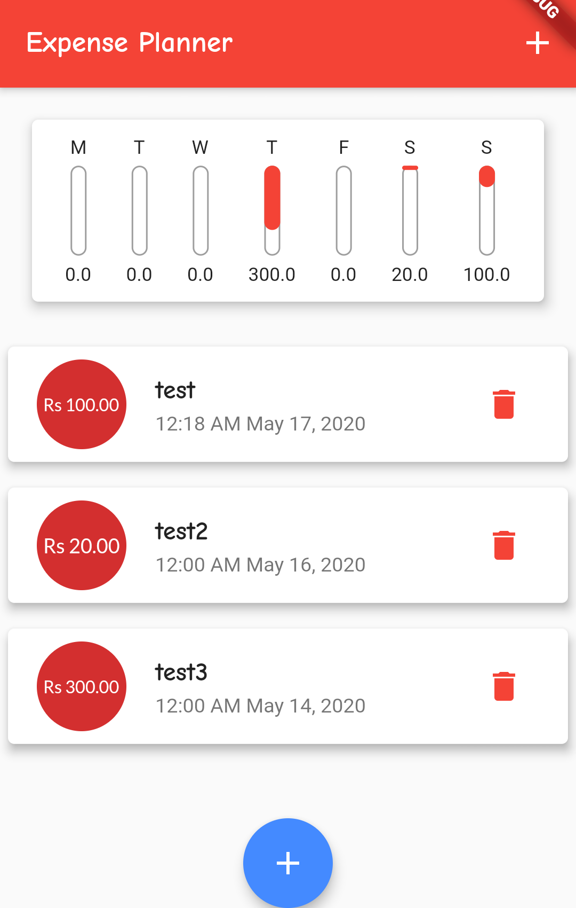
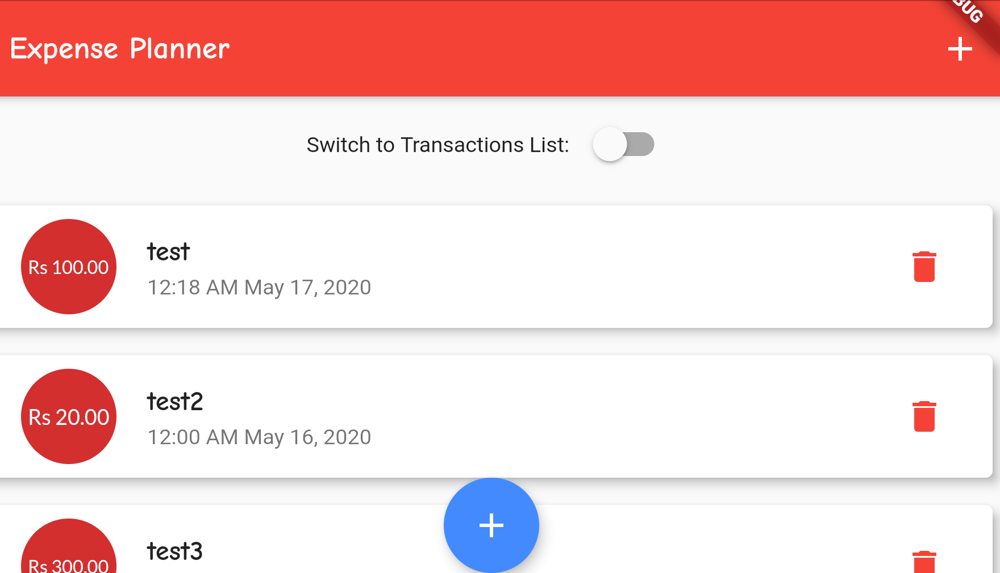
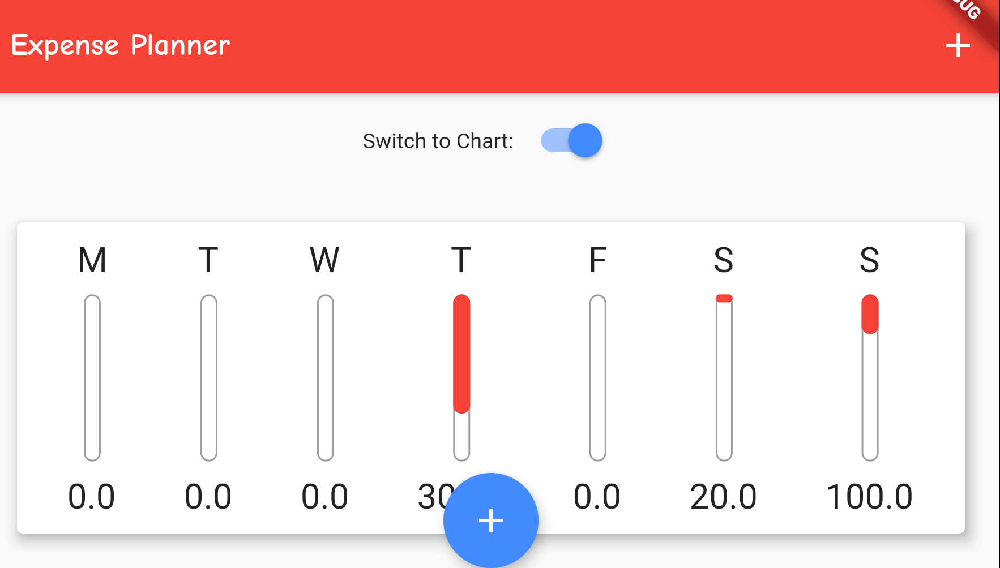
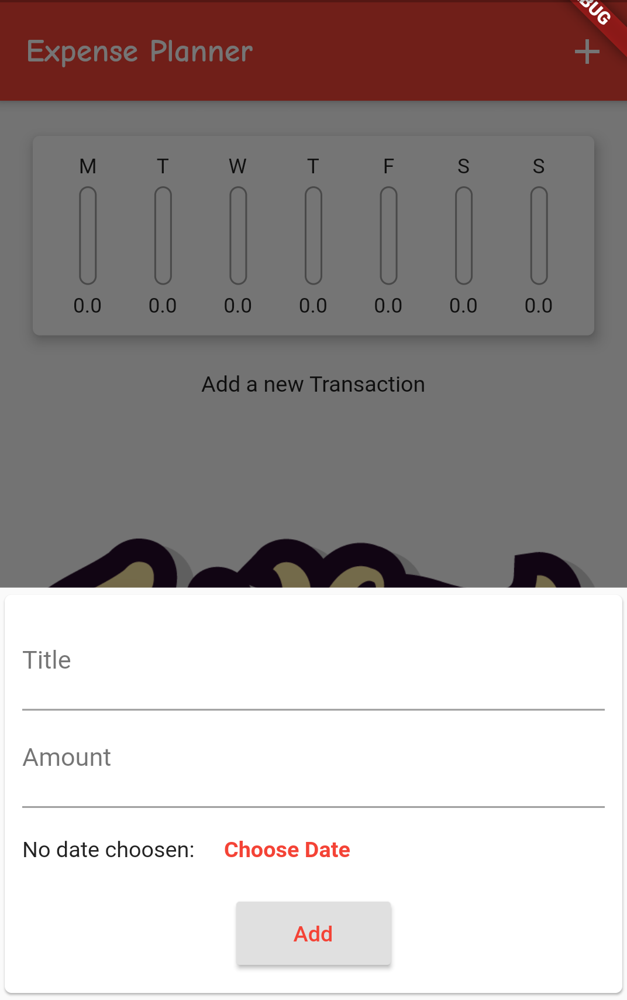
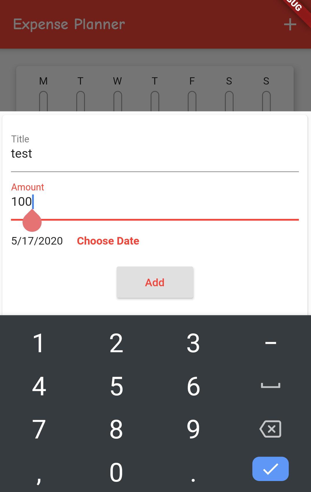
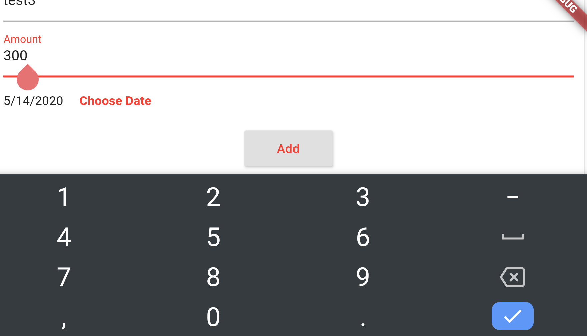
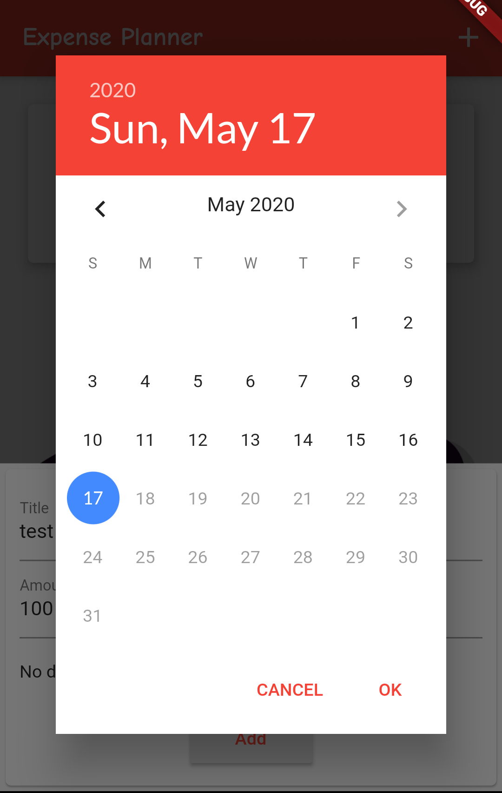

# Expense Planner
An application to record and list past expenses and show a comparison bar chart of expenses of the last week.
- Supports Landscape mode
- Responsive

### Screenshots
- Front Page

- Front Page Landscape

- Add Page

- Add Page Landscape

- Calendar

### Concepts Used/Learnt (No particular order)
- All used in quiz app
- Central theming
- .copyWith()
- WidgetsBindingObserver
- dart:math
- Making a model (Class)
- Application Life cycle
- super keyword -- refers parent class
- DateTime object
- Random.secure()
- Floating Button
- ModalBottomSheet
- mediaQuery
- Switch Button
- Making Responsive
- Theming
- Calculating Size of display and using it to set boundaries
- Text editing controller
- Date Picker
- SingleChildScrollView -- set inside a container
- Adding Image
- ListView -- takes infinite height
- ListView.builder() -- only load what is visible -- better
- Card widget, FittedBox, ListTile
- LayoutBuilder
- FractionallySizedBox
- Theme.ofContext()
- BoxDecoration()
- Column takes space that is needed
- Container takes as set
- mainAxisAlignmnet, crossAxisAlignment
- @required -- flutter/foundation.dart
- .map().toList() -- list into list of widgets
- Use ListView inside a container to set height
- 3 types of trees -- Widget, Element, Render
- Lifecycle -- Stateless -- constructor > build
- Lifecycle -- Stateful -- constructor > initState > build > setState > didUpdate() > build > dispose
- LifeCycle States -- inactice, paused, resumed, suspending
- Mixins -- extending a class -- adding features of other class wo fully inheriting it
- context -- meta info of widget and its location in widget tree
