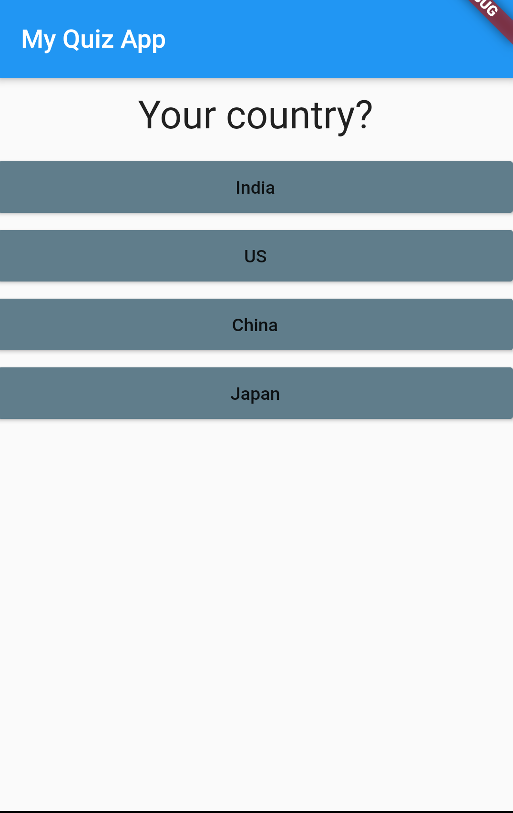

# Quiz App
A simple app with a simple quiz to calculate score and output results.

### Screenshots
- Question Page

- Results Page

### Concepts Used (No particular order)
- Widgets
- Widget trees
- Stateful widgets
- Setting state
- final keyword -- will not change after constructor (Runtime constant)
- const (Compile time constant)
- Getter property/method
- Constructing Objects
- Override, required decorator
- This keyword
- ... - Spread operator to break a list inside into elements
- .map() , .toList() 
- Argument passing -- Precision, Named
- Passing function pointer to be used for buttons
- Private class '_Abc' so that it can be accessed only from this file's main function
- => shorthand for function with one expression
- Scaffold Widget
- Ctrl+Shift+I for prettify, Ctrl + hover, Ctrl+Space  IDE shortcuts
- => () {} -- Anonymous function
- Using Enums
- EdgeInsets
- In Dart, class can have multiple constructors
- Static property of classes
- Callback - when a function is called by another widget using its pointer
- Lifting state Up - Having state in a file and using it in imported files
- as List to specify that object used is of type list
- Using const inside a class
- Row, Column, Container, Scaffold, MaterialApp, Text, TextField, RaisedButton widgets
